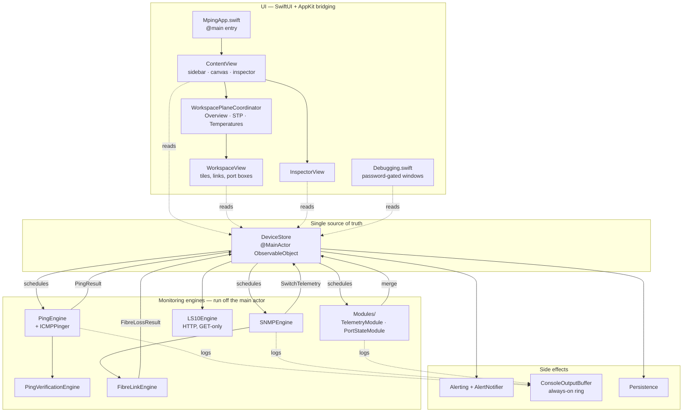
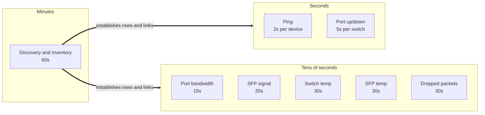
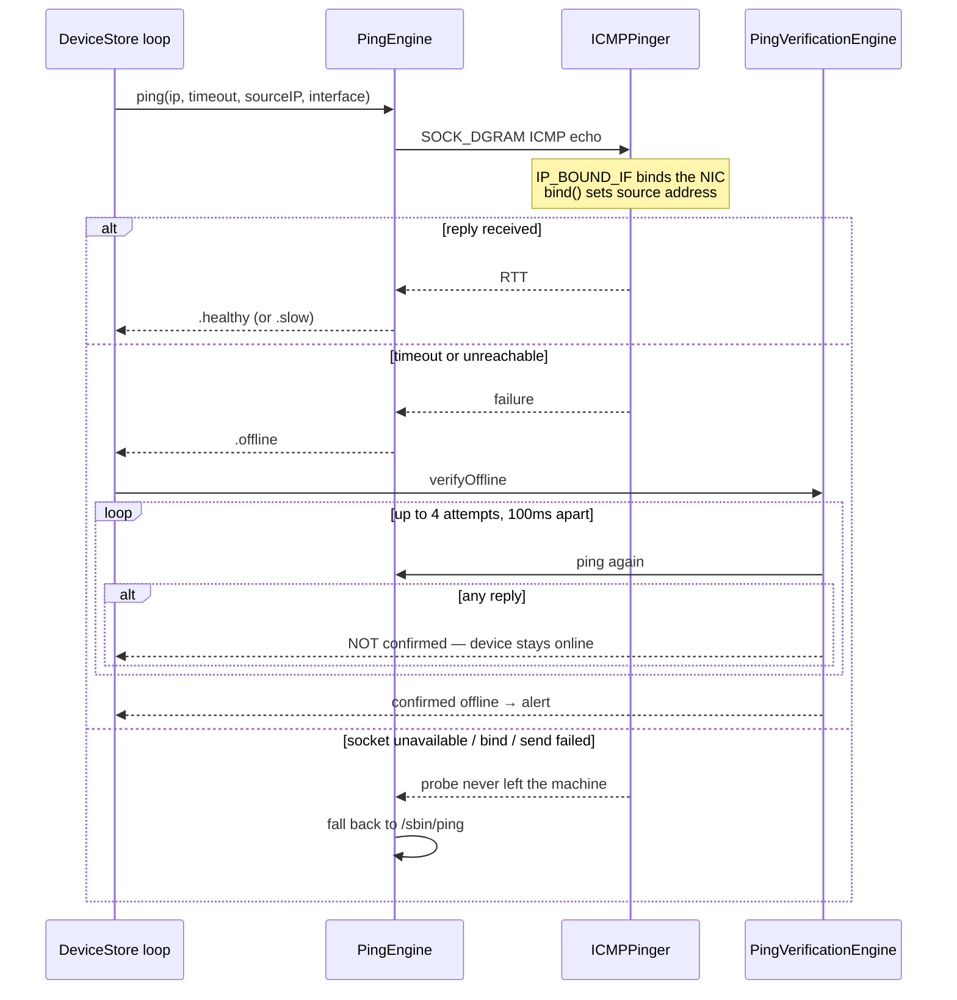
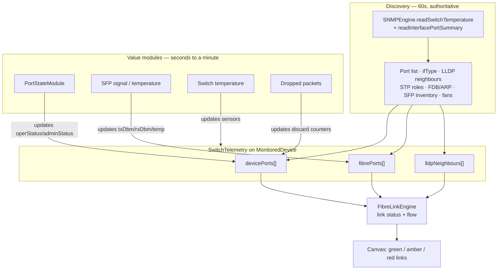
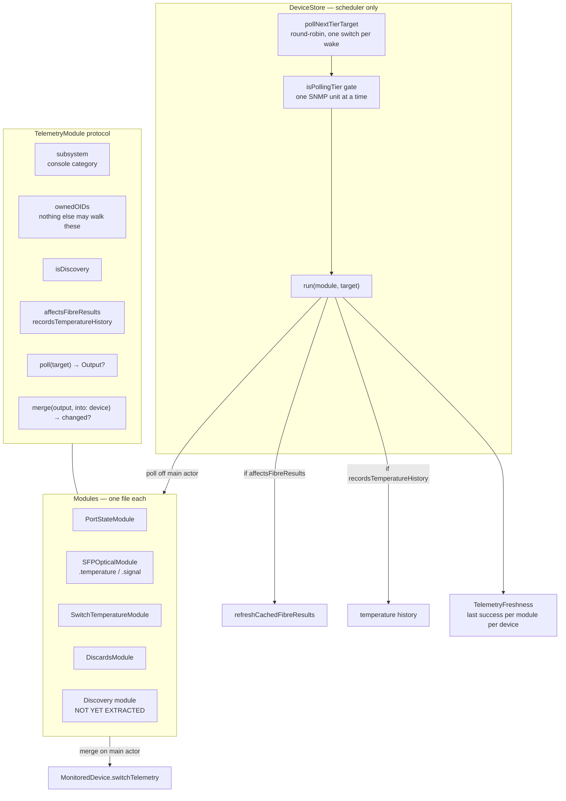
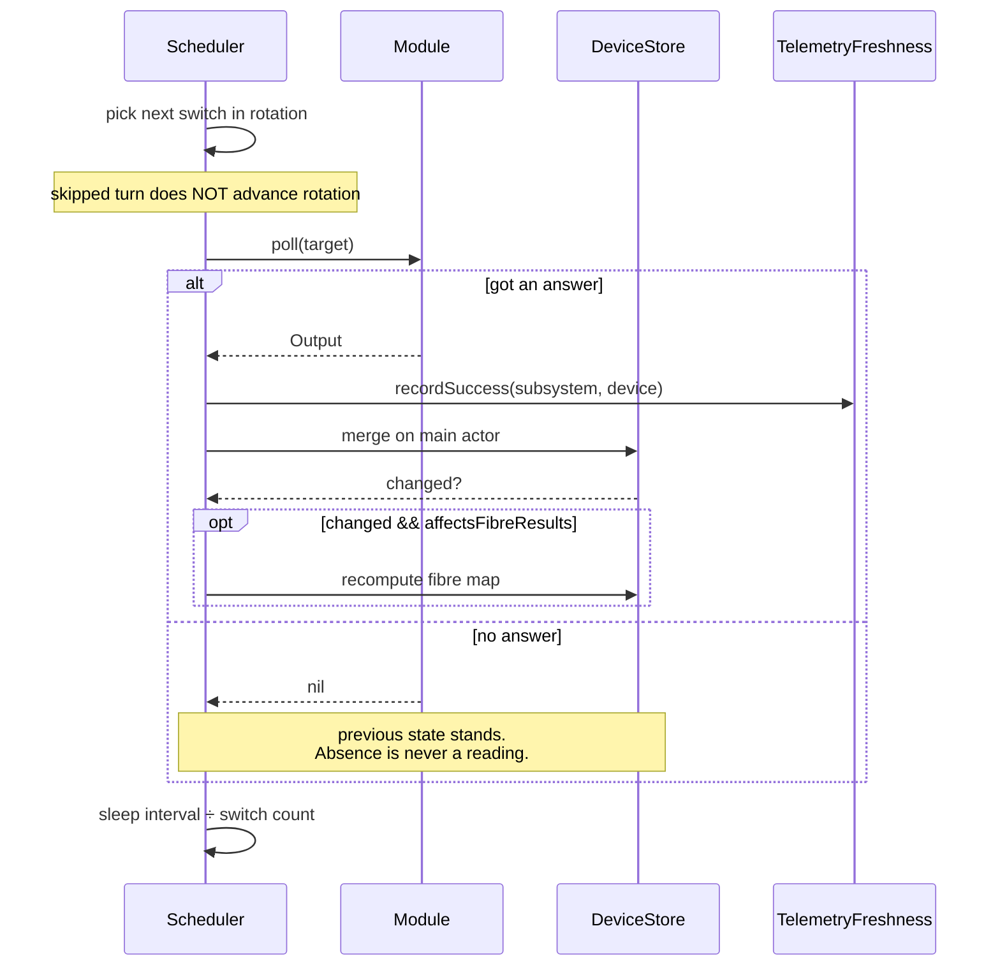
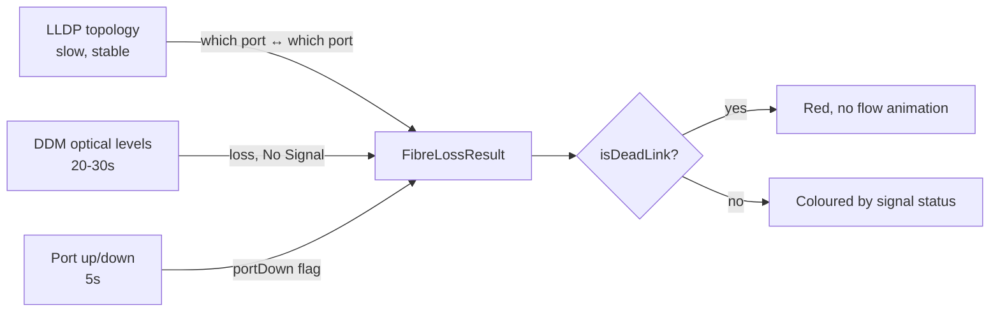
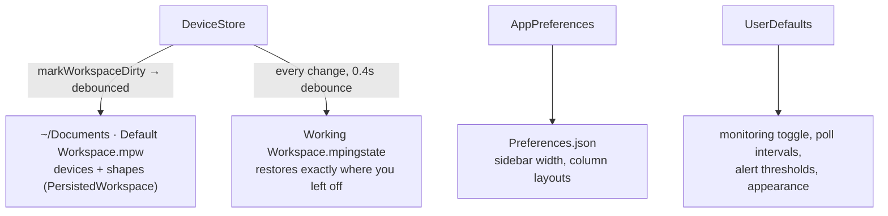
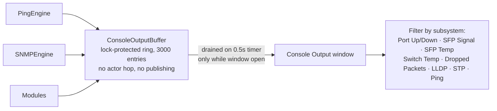

# Mping — Architecture Board

A working map of what runs where, when, and why. Diagrams render natively on GitHub.

> Written 2026-08-03, against `a83223b`/`2577a5d`. When behaviour changes, change this file in the same commit — a stale map is worse than none.

---

## 1. The whole system at a glance

**The one rule that shapes everything:** every mutation goes through `DeviceStore`. Engines never write to each other, and views never write to engines. `DeviceStore` is `@MainActor`; engines run off it and return values.

---

## 2. What runs when — the timing board

| Loop | Interval | Owns | Round-robin? |
|---|---:|---|---|
| Ping | **2s** | ICMP echo per device | per-device tasks |
| Port up/down | **5s** | `ifOperStatus`, `ifAdminStatus` | ✅ one switch per wake |
| Port bandwidth | **15s** | `ifHCInOctets/OutOctets` | ❌ all switches |
| SFP signal | **20s** | DDM cols 5, 6 (+1) | ✅ |
| SFP temperature | **30s** | DDM col 2 (+1) | ✅ |
| Switch temperature | **30s** | 3 Netgear sensor OIDs | ✅ |
| Dropped packets | **30s** | `ifInDiscards`, `ifOutDiscards` | ✅ |
| Discovery & inventory | **60s** | port list, LLDP, STP, FDB, ARP, SFP inventory, fans | ❌ **still bursts** |
| Working-state save | 0.4s debounce | `.mpingstate` | — |

> **Known gap:** the discovery pass still sweeps every switch back-to-back. On a rig with unreachable switches that sweep is the dominant CPU burst (median 1.2%, p90 27.6% measured). Tracked in issue #65.

---

## 3. Ping path and false-offline prevention

The highest-stakes path in the app. Priority order is *monitoring reliability first* — a false offline alert mid-show is worse than a slow one.

**Rules encoded here:**

- A timeout is a **real answer** and is never retried by the subprocess path — otherwise a genuinely down device could be reported up by the slower method.
- The fallback fires **only** when the probe never left the machine.
- Offline requires **4 consecutive failures**; online recovery requires **2** (`PingVerificationEngine.Configuration`).
- `IP_BOUND_IF` matters when two NICs advertise the same subnet — the redundant rig case.

---

## 4. Telemetry: discovery vs values

**Invariants:**

1. **Discovery owns the row set.** Value modules never add or remove ports or links.
2. **Absence is not a reading.** No response leaves previous state untouched — never "all ports down" or "zero drops".
3. **Value modules idle until discovery has run** for that device (`pollTargets(requiringDiscoveredPorts:)`).
4. **One SNMP unit of work at a time** across all tiers (`isPollingTier`), and everything stands aside for discovery.

> **Not yet true:** discovery still walks the value OIDs too, so some are polled twice. Removing that is the point of issue #65, and it needs live hardware — if a module doesn't fully cover what it claims, a reading silently freezes.

---

## 4a. The tiered module system

Every reading is a module: it owns the OIDs that produce it, declares how often it should run, and knows how to merge its own result. `DeviceStore` schedules; it no longer knows how any individual reading works.

### The lifecycle of one reading

### Adding a reading

1. New file in `SNMP-LLDP/Modules/`, conform to `TelemetryModule`.
2. Declare `ownedOIDs` — and remove them from whatever walks them today.
3. One line in `DeviceStore.pollTier` mapping the tier to the module.
4. An interval in `TelemetryPollingDebugSettings`, and a row in the Telemetry Polling window.

Nothing else in the scheduler changes.

### Status

| Module | State |
|---|---|
| `PortStateModule` | ✅ extracted, verified on the live rig |
| `SFPOpticalModule` (temperature + signal) | ✅ extracted |
| `SwitchTemperatureModule` | ✅ extracted |
| `DiscardsModule` | ✅ extracted |
| Bandwidth | ⬜ still inline, own loop |
| LLDP · STP · MAC/ARP · speed/duplex · fans | ⬜ still inside discovery |
| **Discovery** | ⬜ still monolithic, still bursts, **still walks OIDs the modules own** |

**The remaining prize is exclusion.** Until discovery stops walking port state, discards and DDM, those are polled twice. That cutover needs live hardware: if a module doesn't fully cover what it claims to own, the reading silently freezes at its last value and only real switches will show it going stale.

---

## 5. Link liveness — how a dead link turns red

A down port at **either** end means the link is dead, whatever the last DDM reading said. Cable-pulled and lost-light render identically — operationally they're the same. This is also the **only** liveness signal copper links have, since they carry no DDM.

---

## 6. State and persistence

**On boot:** `cleanDeviceForRuntime` resets runtime fields (ping history, lastSeen, MAC, loss history). User fields persist. `MonitoredDevice` has **manual** `CodingKeys` and `init(from:)` — a new field must be added to the struct, `CodingKeys`, the decoder (with `decodeIfPresent` + safe default), the custom init signature *and* body, and `cleanDeviceForPersistence`. Miss one and the field silently vanishes on save.

---

## 7. Console and debugging

Capture is **always on** — the window back-fills when opened. Recording is cheap; it was the *publishing* that cost CPU.

Debug windows are password-gated (SHA-256 digest in `DebugAccess`): Device Tile Editor, Fibre Box Editor, Telemetry Polling, Console Output, Device Debug.

---

## 8. File map

| Area | File | Responsibility |
|---|---|---|
| Entry | `Workspace/MpingApp.swift` | `@main`, menus, splash, update check |
| **Store** | `Workspace/DeviceStore.swift` | Single source of truth; all poll loops |
| Model | `Workspace/Models.swift` | `MonitoredDevice`, `SwitchTelemetry`, manual Codable |
| Ping | `Ping Engine/PingEngine.swift` | Facade: native ICMP, `/sbin/ping` fallback |
| Ping | `Ping Engine/ICMPPinger.swift` | Raw ICMP over `SOCK_DGRAM` |
| Ping | `Ping Engine/PingVerificationEngine.swift` | 4-strike offline / 2-strike online |
| SNMP | `SNMP-LLDP/SNMPEngine.swift` | Client, BER, walks, discovery pass |
| SNMP | `SNMP-LLDP/FibreLinkEngine.swift` | DDM parse, link building, canvas link views |
| SNMP | `SNMP-LLDP/LS10Engine.swift` | L-Acoustics HTTP, **GET-only by design** |
| Modules | `SNMP-LLDP/Modules/TelemetryModule.swift` | Protocol, poll target, freshness |
| Modules | `SNMP-LLDP/Modules/PortStateModule.swift` | Port up/down |
| Modules | `SNMP-LLDP/Modules/SFPOpticalModule.swift` | DDM temperature and TX/RX signal |
| Modules | `SNMP-LLDP/Modules/SwitchTemperatureModule.swift` | Chassis temperature sensors |
| Modules | `SNMP-LLDP/Modules/DiscardsModule.swift` | Dropped-packet counters |
| Canvas | `Workspace/WorkspaceView.swift` | Tiles, right-click menu, drag, port boxes |
| Canvas | `Workspace/WorkspacePlaneCoordinator.swift` | Plane switching, left-edge toolbars |
| Canvas | `Workspace/Planes/TemperatureGraphView.swift` | Temperature plots |
| Ports | `Workspace/DevicePortsView.swift` | Port table + `DevicePortTelemetryExtractor` |
| Alerts | `Alerting/*` | Thresholds, notifications, pulsing borders |
| Debug | `Debugging/Debugging.swift` | Console store/buffer, all debug windows |

---

## 9. Rules to work by

Ordered — earlier beats later when they conflict.

1. **Monitoring reliability** — no false offline alerts, ever.
2. **Stability**
3. **Performance**
4. **Clean architecture**
5. **User experience**
6. **New features**

**Checkpoint before touching:** `PingEngine`, `PingVerificationEngine`, `DeviceStore` (loops/persistence), `SNMPEngine`, `FibreLinkEngine`, `Alerting`, `Models` Codable.

**Measurement rules learned the hard way:**

- Profile **Release**, never Debug — Debug inflates hot loops enough to send you chasing the wrong thing.
- Confirm the **live workspace is loaded and Monitoring is ON** before believing a number.
- `ps %cpu` is a **lifetime average**; sample instantaneously to see what a process is doing *now*.
- Check a new OID's real values with `snmpwalk` before trusting a scaling factor inferred from code. SFP power is milli-dBm; assuming centi-dBm would have shown every link at −61 dBm.

---

## 10. Open threads

| Issue | What |
|---|---|
| #65 | Per-subsystem telemetry modules; **OID exclusion needs live hardware** |
| #60 | Native ICMP — implemented, labelled `needs testing`, do not release untested |
| #63 | Alert when a redundant link drops |
| #59 | SNMP poll cycle re-renders the whole canvas |
| #58 | Refresh topology system-wide on failure |
| #61 | Older macOS compatibility |

---

*Mping is not affiliated with, endorsed by, or supported by NETGEAR or L-Acoustics. OIDs referenced here are from published standard and vendor MIBs.*
