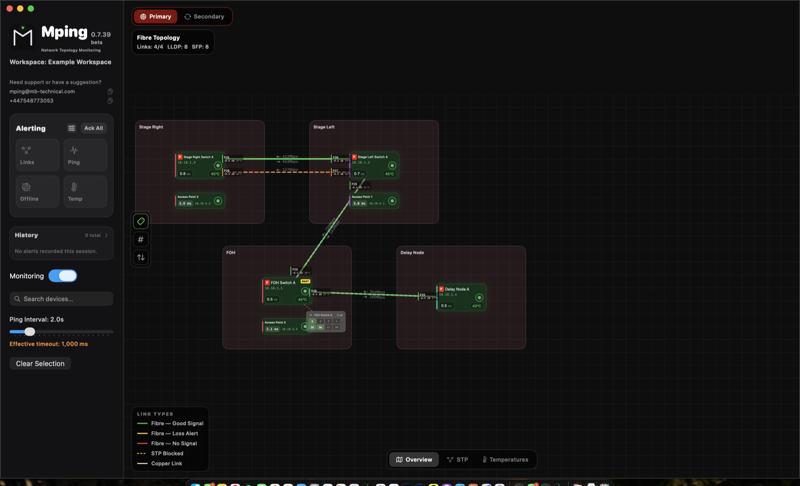
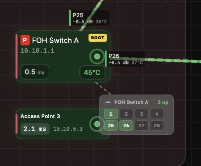
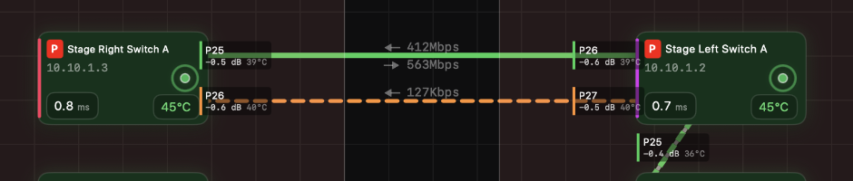
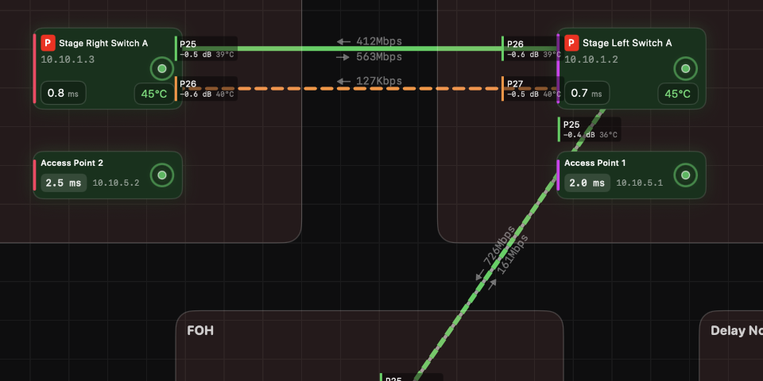
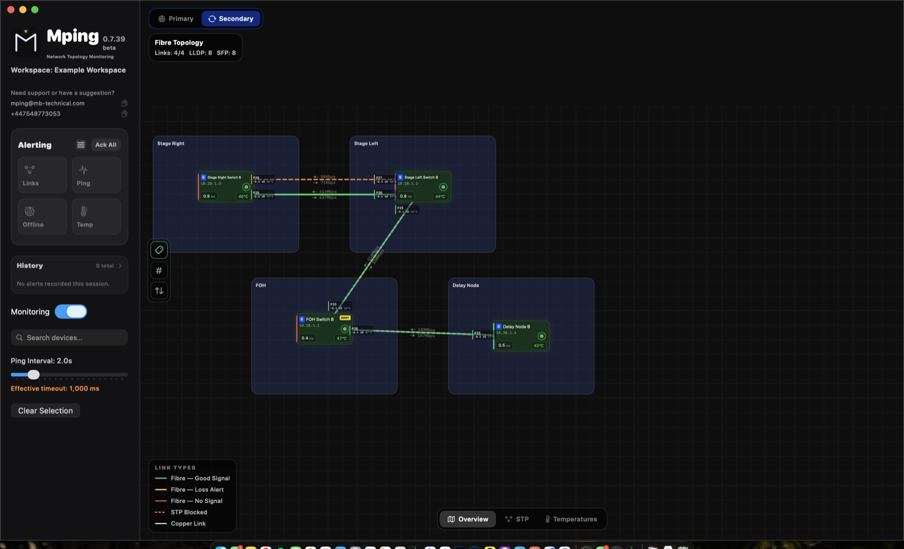
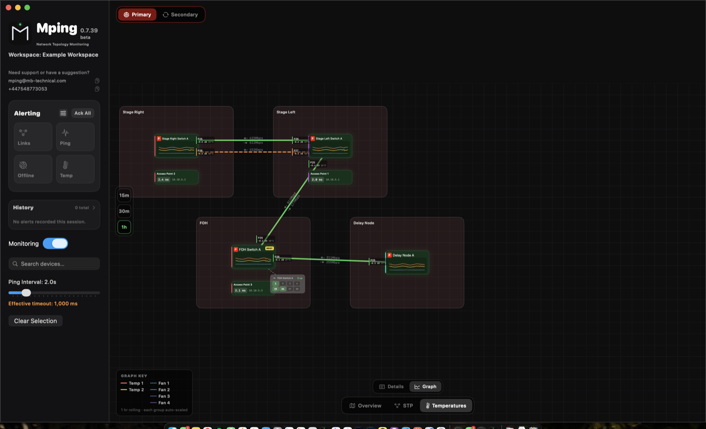
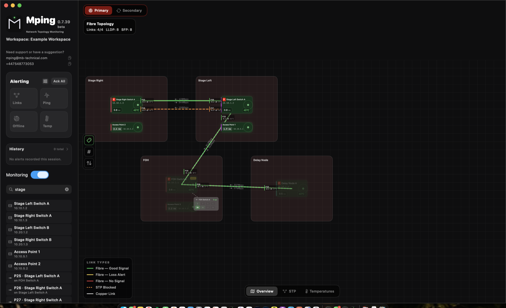
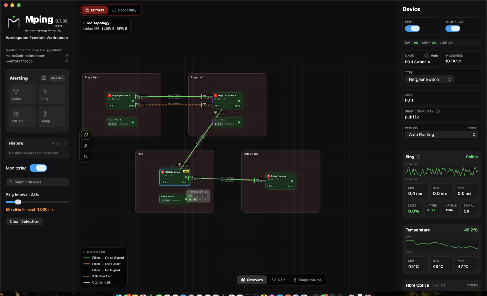
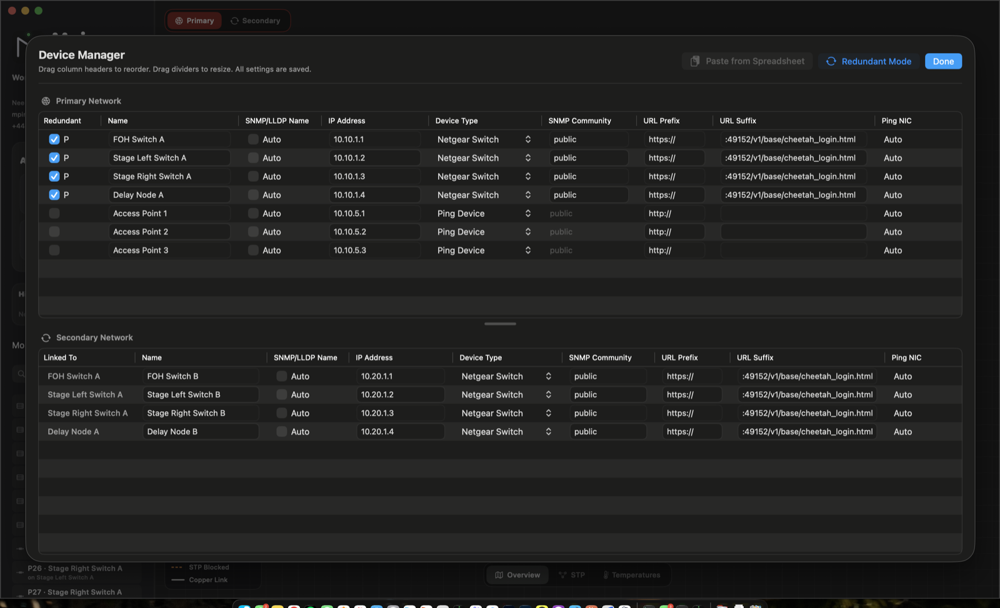

  

<h1 align="center">Mping</h1>

  <strong>Professional network monitoring for live event production.</strong> 
  Built for touring, festival, fixed installation, and live broadcast engineers.

  
  
  
  

---

## What is Mping?

Network monitoring built for show engineers, not IT departments. Everything on one canvas, readable at a glance from the FOH position.

- Know the instant a device drops — with **no false alerts**
- Your whole network as an interactive topology map
- The numbers that matter: RTT, jitter, packet loss, fibre loss, SFP temperature and signal
- Built around **Netgear AV**, **AVB/Milan**, **L-Acoustics** and fibre rigs

## Features

*Every screenshot below is Mping's built-in example workspace — a redundant four-switch fibre rig with access points — exactly as the app draws it.*

### The whole rig on one canvas

Every switch, amplifier and access point is a live tile — round-trip time, temperature and status readable from across the room. Fibre links are discovered automatically over LLDP and drawn with **per-end optical loss in dB** and **live per-port bandwidth**. Traffic direction animates toward the root bridge, and a blocked redundant path is drawn as exactly that — an orange dashed line, not a healthy link. Zone boxes group the rig the way it is racked, tiles drag freely, and a venue plan can sit behind everything (PNG, JPEG or PDF, with smart invert so black-on-white drawings read correctly on the dark canvas).

<table>
<tr>
<td width="55%" valign="top">

### Ping you can trust

A device is **never marked offline until a verification burst confirms it** — one lost packet on a busy network does not page you. Round-trip times are stamped by the kernel at packet arrival, so the numbers match `ping` in a terminal instead of inheriting the app's scheduling noise. Loss %, jitter and uptime are tracked per device, and jitter alerts only fire on a breach sustained across consecutive real cycles.

</td>
<td width="45%" valign="top">

</td>
</tr>
<tr>
<td width="55%" valign="top">

### Fibre and SFP optics, per module

Optical TX/RX power, temperature, voltage and laser bias for every SFP, read over DDM. Link labels carry the measured **loss of each direction** of every span, with alerts on your dB threshold — and a link whose light disappears goes red immediately. Copper SFPs are told apart from optical automatically, so the map never claims fibre where there is none.

</td>
<td width="45%" valign="top">

</td>
</tr>
<tr>
<td width="55%" valign="top">

### Spanning tree, drawn honestly

STP state lives right on the map: the root bridge wears a gold badge, blocked redundant paths draw as dashed amber, and traffic-flow arrows animate toward the root — computed from the switches' own designated-bridge votes. If the data cannot prove a direction, Mping draws **no arrow rather than a guessed one**.

</td>
<td width="45%" valign="top">

</td>
</tr>
<tr>
<td width="55%" valign="top">

### Redundant networks are first-class

Primary and secondary planes as two tabs of one workspace. Devices pair with their redundant twins, share canvas position and port-box layout, and wear P/S badges. Each plane keeps its own topology, its own link map and its own alert focus — clicking a secondary alert takes you to the secondary plane.

</td>
<td width="45%" valign="top">

</td>
</tr>
<tr>
<td width="55%" valign="top">

### Heat, before it becomes a problem

Both temperature sensors and all four fans of every switch, polled continuously with configurable alert thresholds. The Temperatures plane turns every tile into a **rolling one-hour graph** of sensors and fans, with hover readouts — a quiet rack at load-in and a hot one at showtime are one glance apart.

</td>
<td width="45%" valign="top">

</td>
</tr>
<tr>
<td width="55%" valign="top">

### Search that knows your patch

Search matches devices — and **switch ports**, by LLDP neighbour name or by the endpoint IP resolved from the switch's own learned-MAC and ARP tables. Type an device's IP and Mping finds the port it is plugged into, opens that switch's port box, and flashes the exact cell.

</td>
<td width="45%" valign="top">

</td>
</tr>
<tr>
<td width="55%" valign="top">

### One click, whole story

The inspector shows a device's live RTT sparkline, loss, jitter and uptime, temperature history, and a card per SFP — TX/RX, temperature, voltage, bias, vendor and serial. Per-device toggles for ping and SNMP monitoring, and a protocols strip showing per-transport health at a glance.

</td>
<td width="45%" valign="top">

</td>
</tr>
<tr>
<td width="55%" valign="top">

### Set up a rig in minutes

Add a show's worth of devices in one action, then **paste names and IPs straight from a spreadsheet** — the table fills live as you paste. Bulk-edit zone, type, community and monitoring state across a selection. In redundant mode the manager pairs both networks side by side.

</td>
<td width="45%" valign="top">

</td>
</tr>
</table>

### And for the engineer who reads spec sheets

- **Port status boxes** — a draggable companion per switch that replicates the physical racks with your kit in: per-column heights, drag-in placement, cells labelled with LLDP name, endpoint IP or drop counters, red-until-verified on reopen
- **Alerts that latch** — offline, RTT, jitter, fibre loss and temperature alerts stand until acknowledged, with full history; recovered-but-unacknowledged shows amber, and macOS notifications reach you when Mping is in the background
- **Hold ⌥ Option** to flip every tile's IP to its MAC address, learned live from the network
- **Honest by design** — topology memory is session-only: every launch draws only what the switches prove now, never yesterday's assumptions
- **One portable file** — a workspace is a single `.mpw` including the venue plan; open it on another Mac and the whole rig comes with it
- **Multi-NIC aware** — ping and SNMP bind to the interface you choose per device, built for FOH Macs riding two networks at once
- **Show-safe footprint** — engineered for low CPU and few wake-ups so the Monitoring Mac stays cool and silent; read-only throughout: Mping never writes a single setting to any device

---

## Install

1. Download **`Mping-x.y.z.dmg`** from the [**latest release**](https://github.com/therealjackiewelles/Mping/releases/latest)
2. Open it and drag **Mping** into Applications
3. **First launch: right-click Mping → Open**, then click Open again

> **Step 3 is not optional.** Mping is not yet notarised by Apple, so double-clicking it the first time shows a warning and refuses to launch. Right-click → Open is the way past it, and macOS only asks once. If macOS says the app is *"damaged"*, that is the same thing — the file is fine.

Workspaces are stored in `~/Documents/Mping`, never inside the app, so updates never touch your data.

**Updates:** Mping checks GitHub on launch and once a day. Feature releases offer to download and install themselves; patch releases are quiet — check any time via **Mping → Check for Updates…**. It is one anonymous request to GitHub. No account, no tracking.

---

## Setting up Netgear AV switches

Mping reads switch telemetry over SNMP — port status, temperatures, SFP levels, LLDP neighbours and STP state. The switch needs a read-only community string before any of that appears.

### 1. Create an SNMP community on the switch

In the switch's **main web UI** (not the AV UI), find the SNMP section — on M4250/M4300 it is under **System → SNMP → Community Configuration**.

- **Community string** — a name of your choosing, e.g. `mping`. This is effectively a password, so avoid `public` on a show network
- **Access mode** — **read-only**. Mping never writes to a switch, and read-write access is not needed
- **Client address** — restrict it to the Mac running Mping if your switch supports it, or leave open on a closed show network
- Make sure the community is **enabled**, and that SNMP itself is enabled on the switch

### 2. Add the switch in Mping

Right-click the canvas → **Add Device**, then in the inspector set:

- **IP address** of the switch
- **Type** → *Netgear Switch*
- **SNMP community** → the string you just created
- **Ping NIC** → the interface that reaches this switch

Telemetry appears on the next poll. If nothing arrives, open **Debugging → Console Output** and filter by subsystem to see exactly which OIDs were asked for and what came back.

### 3. What Mping does and does not do

Mping is **read-only by design**. It issues SNMP GET and WALK requests only, and never SET. It cannot change a switch's configuration, and the L-Acoustics HTTP integration is likewise GET-only.

---

## Redundant networks and dual NICs

A redundant rig usually means two physically separate networks — primary and secondary — often using **the same subnet on both**. That is where macOS gets in the way.

### The problem

With two NICs on overlapping subnets, macOS decides which interface to use from its routing table, not from which cable you meant. Replies arriving on the "wrong" interface are dropped by reverse-path filtering, so devices appear offline even though they are reachable.

### The fix — static host routes

Mping generates the routes for you. In **Preferences → Dual-NIC Static Routes**:

1. Set a specific **Ping NIC** on each device in the inspector — not *Auto Routing*. Only devices with an explicit NIC can be routed
2. Open the Dual-NIC Static Routes panel and press **Apply**
3. The commands are copied to your clipboard and Terminal opens — press **⌘V** then **Return**, and enter your admin password

This tells macOS exactly which interface to use for each device, so replies are accepted on the right one.

> **Remove the routes before you disconnect a NIC.** A static route pointing at an interface that is no longer there will black-hole all traffic to those devices until it is removed. The same panel has a **Remove** button.

### Primary and secondary

Once devices are paired, the **Primary / Secondary** tabs at the top of the canvas switch the whole view between the two networks. A secondary device sits in the same position as its primary, so the layout stays identical as you flip between them.

---

## Requirements

- macOS 13 Ventura or later
- Netgear AV switches for SNMP telemetry (any pingable device works for basic monitoring)
- A network route to the devices you want to monitor

---

## Ideas, questions and problems

- **Ideas & feature requests:** [Discussions](https://github.com/therealjackiewelles/Mping/discussions) — tell me what Mping should do. What you would use it for on a rig matters more than how it should work
- **Questions:** [Q&A](https://github.com/therealjackiewelles/Mping/discussions/categories/q-a)
- **Bugs:** [Issues](https://github.com/therealjackiewelles/Mping/issues)
- **Email:** mping@mb-technical.com · **Phone:** +44 7548 773053

[**How it works →**](ARCHITECTURE.md) — the system board: what runs when, and why.

---

## Trademarks & affiliation

Mping is an independent product. It is not affiliated with, endorsed by, or supported by NETGEAR or L-Acoustics. All trademarks belong to their respective owners.

## Licence

Proprietary — Copyright © 2026 Morgan Beecher / MB Technical. All rights reserved. See [LICENSE.md](LICENSE.md).

The application source is maintained in a private repository; this repository hosts releases, documentation, and the issue tracker.

---

## Recent releases

<!-- CHANGELOG:START -->

## v0.8.8 — 2026-08-29

**Features added**
- Console output is written to disk live, per session — nothing is lost to scroll-back or a quit. Newest 14 sessions kept within 4 GB
- New NTP tab in Preferences (Work In Progress): Mping as the rig's time server and syslog collector, so switch clocks stay right and switch logs land next to ping/SNMP traffic
- Amps plugged into Netgear switches are discovered and monitored the same way LS10-attached amps are
- Temperature graphs gained gridlines and a value scale; the hover readout sits beside the tile instead of covering the graph

**Bug fixes**
- Nemo graphs no longer show gaps — meter polls stopped queueing behind full switch sweeps
- Healthy links no longer vanish in bulk when a switch briefly serves blank LLDP tables
- False bandwidth spikes (tens of Gbps on an idle link) eliminated
- Switch Credentials tab marked Work In Progress while that workflow is reworked

**Performance**
- Scroll-wheel zoom is faster and no longer judders on a large workspace
## v0.8.7 — 2026-08-26

**Features added**
- Simple ping devices draw a link line to their switch port, found from the switch's own MAC tables — no LLDP needed
- "Mute link lines" checkbox per device — hides its lines, purely visual, saved with the workspace
- LS10 tiles graph their amps' temperatures on the Temperatures plane, with legend and hover readout; history survives a restart
- Help ▸ Export All Logs zips the console trace and alert history; alert history also exports as CSV on its own
- Nemo graph cards pin to both network tabs and show live per-phase now/min/max
- Device search ranks exact matches first, highlights as you type, clears on Escape, and matches amps by name, model, and IP
- Port box editor: shift-click selects a run of ports; row and column limits cap at the device's real port count

**Bug fixes**
- 26-port switches no longer offer 70-port trays — a complete probe replaces the stored port list
- SNMP sockets that die silently are replaced instead of leaving a device dark until relaunch
- SNMP answers are checked against the question asked — a byte counter can no longer become a device's name
- Port box names resolve through the confirmed topology first, so garbage LLDP can't mislabel a port
- Phantom quadruple links ended: a new link needs two consecutive polls and both switches' agreement
- "Amp no longer visible on LLDP" needs two missing sweeps — no more false alerts from partial reads
- Devices that report no temperatures keep their full overview card on the Temperatures plane
- All overview port boxes share one text size

**Performance**
- Voltage graphs hold a fixed ±5 V window with 1 V gridlines, opening up only for a genuine sag or surge
- Nemo graph card re-laid to give the plot nearly all the card
## v0.8.6 — 2026-08-21

**Bug fixes**
- Fixed a rare fault where ping stayed green but SNMP and HTTP went dark app-wide — offline devices were triggering a subprocess pileup that starved all other polling
- The remaining ping fallback path is capped so it can never pile up again
- The app asks for its full allowance of open connections at launch, removing a ceiling a busy show could reach
- Nemo power graphs no longer reshuffle constantly while a long time window is still filling

**[Full changelog →](CHANGELOG.md)** — every release since v0.3.0.

<!-- CHANGELOG:END -->
