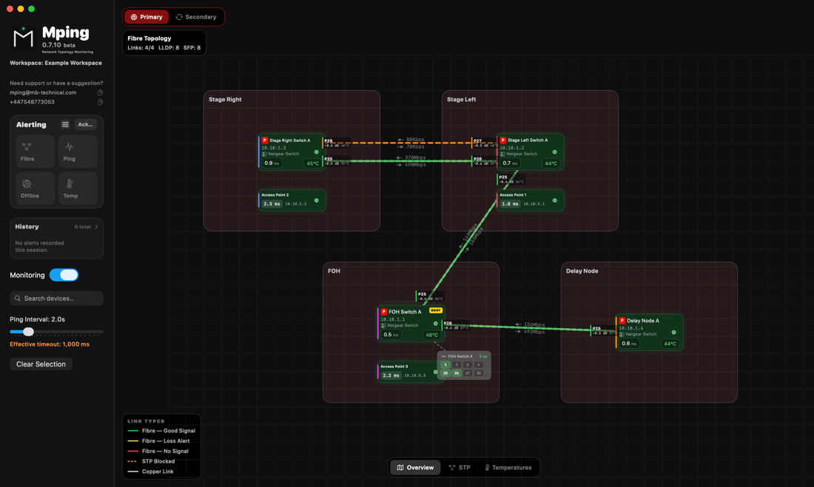

  

<h1 align="center">Mping</h1>

  <strong>Professional network monitoring for live event production.</strong> 
  Built for touring, festival, fixed installation, and live broadcast engineers.

  
  
  
  

---

## What is Mping?

Network monitoring built for show engineers, not IT departments. Everything on one canvas, readable at a glance from the FOH position.

- Know the instant a device drops — with **no false alerts**
- Your whole network as an interactive topology map
- The numbers that matter: RTT, jitter, packet loss, fibre loss, SFP temperature and signal
- Built around **Netgear AV**, **AVB/Milan**, **L-Acoustics** and fibre rigs

---

## Install

1. Download **`Mping-x.y.z.dmg`** from the [**latest release**](https://github.com/therealjackiewelles/Mping/releases/latest)
2. Open it and drag **Mping** into Applications
3. **First launch: right-click Mping → Open**, then click Open again

> **Step 3 is not optional.** Mping is not yet notarised by Apple, so double-clicking it the first time shows a warning and refuses to launch. Right-click → Open is the way past it, and macOS only asks once. If macOS says the app is *"damaged"*, that is the same thing — the file is fine.

Workspaces are stored in `~/Documents/Mping`, never inside the app, so updates never touch your data.

**Updates:** Mping checks GitHub on launch and once a day. Feature releases offer to download and install themselves; patch releases are quiet — check any time via **Mping → Check for Updates…**. It is one anonymous request to GitHub. No account, no tracking.

---

## Setting up Netgear AV switches

Mping reads switch telemetry over SNMP — port status, temperatures, SFP levels, LLDP neighbours and STP state. The switch needs a read-only community string before any of that appears.

### 1. Create an SNMP community on the switch

In the switch's **main web UI** (not the AV UI), find the SNMP section — on M4250/M4300 it is under **System → SNMP → Community Configuration**.

- **Community string** — a name of your choosing, e.g. `mping`. This is effectively a password, so avoid `public` on a show network
- **Access mode** — **read-only**. Mping never writes to a switch, and read-write access is not needed
- **Client address** — restrict it to the Mac running Mping if your switch supports it, or leave open on a closed show network
- Make sure the community is **enabled**, and that SNMP itself is enabled on the switch

### 2. Add the switch in Mping

Right-click the canvas → **Add Device**, then in the inspector set:

- **IP address** of the switch
- **Type** → *Netgear Switch*
- **SNMP community** → the string you just created
- **Ping NIC** → the interface that reaches this switch

Telemetry appears on the next poll. If nothing arrives, open **Debugging → Console Output** and filter by subsystem to see exactly which OIDs were asked for and what came back.

### 3. What Mping does and does not do

Mping is **read-only by design**. It issues SNMP GET and WALK requests only, and never SET. It cannot change a switch's configuration, and the L-Acoustics HTTP integration is likewise GET-only.

---

## Redundant networks and dual NICs

A redundant rig usually means two physically separate networks — primary and secondary — often using **the same subnet on both**. That is where macOS gets in the way.

### The problem

With two NICs on overlapping subnets, macOS decides which interface to use from its routing table, not from which cable you meant. Replies arriving on the "wrong" interface are dropped by reverse-path filtering, so devices appear offline even though they are reachable.

### The fix — static host routes

Mping generates the routes for you. In **Preferences → Dual-NIC Static Routes**:

1. Set a specific **Ping NIC** on each device in the inspector — not *Auto Routing*. Only devices with an explicit NIC can be routed
2. Open the Dual-NIC Static Routes panel and press **Apply**
3. The commands are copied to your clipboard and Terminal opens — press **⌘V** then **Return**, and enter your admin password

This tells macOS exactly which interface to use for each device, so replies are accepted on the right one.

> **Remove the routes before you disconnect a NIC.** A static route pointing at an interface that is no longer there will black-hole all traffic to those devices until it is removed. The same panel has a **Remove** button.

### Primary and secondary

Once devices are paired, the **Primary / Secondary** tabs at the top of the canvas switch the whole view between the two networks. A secondary device sits in the same position as its primary, so the layout stays identical as you flip between them.

---

## Requirements

- macOS 13 Ventura or later
- Netgear AV switches for SNMP telemetry (any pingable device works for basic monitoring)
- A network route to the devices you want to monitor

---

## Ideas, questions and problems

- **Ideas & feature requests:** [Discussions](https://github.com/therealjackiewelles/Mping/discussions) — tell me what Mping should do. What you would use it for on a rig matters more than how it should work
- **Questions:** [Q&A](https://github.com/therealjackiewelles/Mping/discussions/categories/q-a)
- **Bugs:** [Issues](https://github.com/therealjackiewelles/Mping/issues)
- **Email:** mping@mb-technical.com · **Phone:** +44 7548 773053

[**How it works →**](ARCHITECTURE.md) — the system board: what runs when, and why.

---

## Trademarks & affiliation

Mping is an independent product. It is not affiliated with, endorsed by, or supported by NETGEAR or L-Acoustics. All trademarks belong to their respective owners.

## Licence

Proprietary — Copyright © 2026 Morgan Beecher / MB Technical. All rights reserved. See [LICENSE.md](LICENSE.md).

The application source is maintained in a private repository; this repository hosts releases, documentation, and the issue tracker.

---

## Recent releases

<!-- CHANGELOG:START -->

## v0.7.24 — 2026-08-03

### Mping runs on macOS 13 Ventura again

**If Mping refused to install on your Mac, this is the release to get.**

Previous builds were accidentally marked as requiring the very newest macOS, so they would not install on anything older — even though Mping has always been documented as running on Ventura or later. That was a packaging mistake, not a real requirement.

- **Minimum is now macOS 13 Ventura**, as documented
- Nothing else changes — no features were removed to achieve it

One small difference on Ventura: in the workspace search box, Tab no longer arms reverse-cycling through results. Enter still cycles forward as normal.
## v0.7.23 — 2026-08-03

### Adding devices

- **A name is no longer required** to start monitoring. It is a label for you, not something the network cares about — only an IP address and a Ping NIC are needed now
- **Setup completes when you click away**, not only when you press Enter. Moving from one field straight to another used to leave the change uncommitted
- **New devices no longer land on top of each other.** Adding several in a row lays them out in a row instead of stacking them in one spot where the ones underneath couldn't be seen or clicked
- Setup starts with the IP field focused, since that is what it actually needs
- Choosing the Ping NIC now completes setup immediately — it is usually the last step

### Under the hood

- Whether a device is ready to monitor is now decided in one place. The rule was written out twice, which is why setup behaved differently depending on how you left the field
- The pulsing highlight on unfilled fields is created and destroyed as you type; it now cleans up after itself properly
## v0.7.22 — 2026-08-03

### Temperature graphs

- **The scale now fits the readings.** The graph used a fixed 15–70°C axis, so a switch moving 43°C to 46°C barely registered. It now scales to the temperatures actually on screen, plus 5°C either side — a few degrees of movement is immediately obvious, and two sensors drifting apart is easy to see
- **A steady sensor still looks steady.** The 5°C padding keeps the axis at least 10°C tall, so normal fluctuation reads as small rather than filling the plot
- **Curved lines** instead of straight segments, so a trend reads as a trend. Every reading is still plotted exactly — nothing is smoothed away
- **30 minute window** by default instead of an hour, switchable between 15m, 30m and 1h from buttons on the left of the workspace
- Fan speeds keep their fixed scale — they sit behind the temperature lines as context, and rescaling them would make idle fan noise swing across the graph

### Telemetry

- **Fixed SFP signal readings on the faster optical poll.** Optical power is reported in thousandths of a dBm; it was being read as hundredths, which would have shown healthy links at around −61 dBm and marked them as failed. Found and corrected against live hardware
- **Individual readings can no longer be switched off** — the polling controls now set how often each one refreshes, not whether it happens. Switch temperature and dropped packets refresh every 30s, SFP signal every 20s, SFP temperature every 30s, port state every 5s

**[Full changelog →](CHANGELOG.md)** — every release since v0.3.0.

<!-- CHANGELOG:END -->
