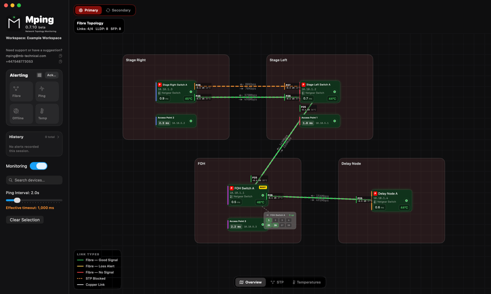
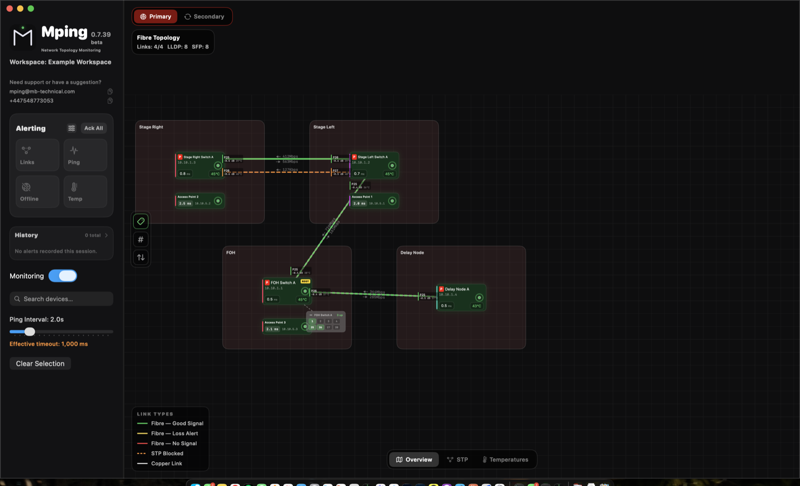
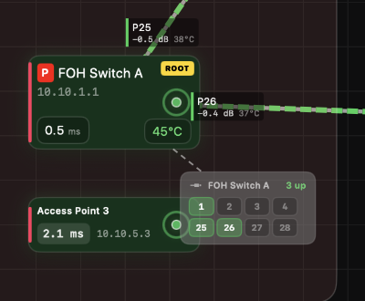
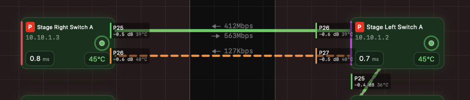
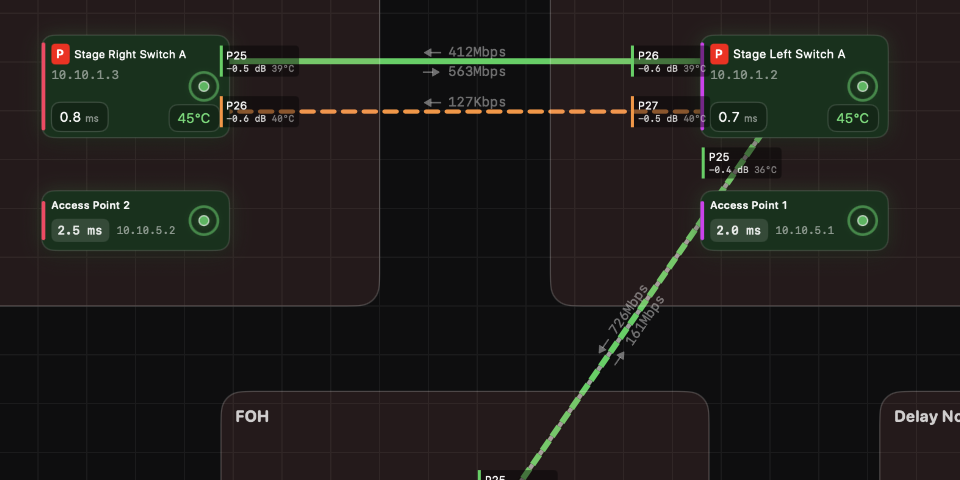
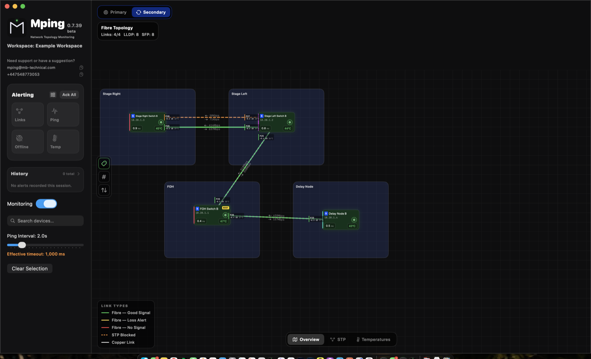
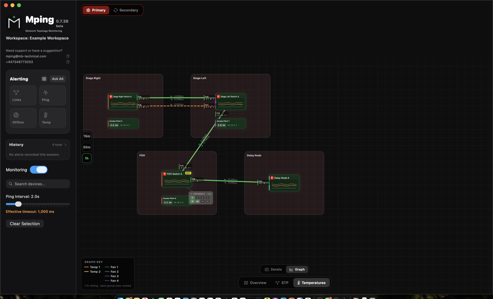
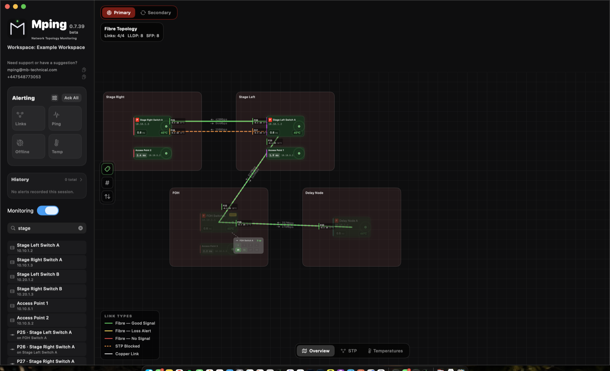
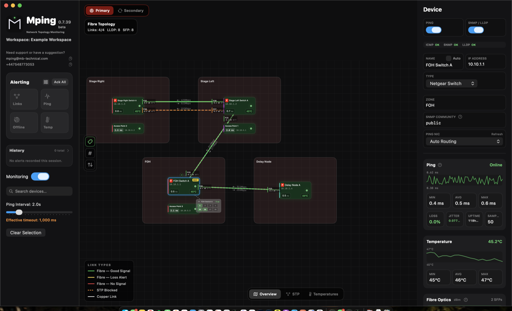
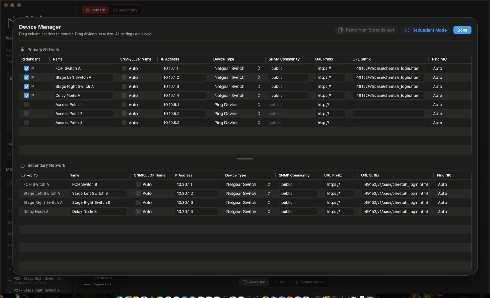

  

<h1 align="center">Mping</h1>

  <strong>Professional network monitoring for live event production.</strong> 
  Built for touring, festival, fixed installation, and live broadcast engineers.

  
  
  
  

---

## What is Mping?

Network monitoring built for show engineers, not IT departments. Everything on one canvas, readable at a glance from the FOH position.

- Know the instant a device drops — with **no false alerts**
- Your whole network as an interactive topology map
- The numbers that matter: RTT, jitter, packet loss, fibre loss, SFP temperature and signal
- Built around **Netgear AV**, **AVB/Milan**, **L-Acoustics** and fibre rigs

## Features

*Every screenshot below is Mping's built-in example workspace — a redundant four-switch fibre rig with access points — exactly as the app draws it.*

### The whole rig on one canvas

Every switch, amplifier and access point is a live tile — round-trip time, temperature and status readable from across the room. Fibre links are discovered automatically over LLDP and drawn with **per-end optical loss in dB** and **live per-port bandwidth**. Traffic direction animates toward the root bridge, and a blocked redundant path is drawn as exactly that — an orange dashed line, not a healthy link. Zone boxes group the rig the way it is racked, tiles drag freely, and a venue plan can sit behind everything (PNG, JPEG or PDF, with smart invert so black-on-white drawings read correctly on the dark canvas).

<table>
<tr>
<td width="55%" valign="top">

### Ping you can trust

A device is **never marked offline until a verification burst confirms it** — one lost packet on a busy network does not page you. Round-trip times are stamped by the kernel at packet arrival, so the numbers match `ping` in a terminal instead of inheriting the app's scheduling noise. Loss %, jitter and uptime are tracked per device, and jitter alerts only fire on a breach sustained across consecutive real cycles.

</td>
<td width="45%" valign="top">

</td>
</tr>
<tr>
<td width="55%" valign="top">

### Fibre and SFP optics, per module

Optical TX/RX power, temperature, voltage and laser bias for every SFP, read over DDM. Link labels carry the measured **loss of each direction** of every span, with alerts on your dB threshold — and a link whose light disappears goes red immediately. Copper SFPs are told apart from optical automatically, so the map never claims fibre where there is none.

</td>
<td width="45%" valign="top">

</td>
</tr>
<tr>
<td width="55%" valign="top">

### Spanning tree, drawn honestly

STP state lives right on the map: the root bridge wears a gold badge, blocked redundant paths draw as dashed amber, and traffic-flow arrows animate toward the root — computed from the switches' own designated-bridge votes. If the data cannot prove a direction, Mping draws **no arrow rather than a guessed one**.

</td>
<td width="45%" valign="top">

</td>
</tr>
<tr>
<td width="55%" valign="top">

### Redundant networks are first-class

Primary and secondary planes as two tabs of one workspace. Devices pair with their redundant twins, share canvas position and port-box layout, and wear P/S badges. Each plane keeps its own topology, its own link map and its own alert focus — clicking a secondary alert takes you to the secondary plane.

</td>
<td width="45%" valign="top">

</td>
</tr>
<tr>
<td width="55%" valign="top">

### Heat, before it becomes a problem

Both temperature sensors and all four fans of every switch, polled continuously with configurable alert thresholds. The Temperatures plane turns every tile into a **rolling one-hour graph** of sensors and fans, with hover readouts — a quiet rack at load-in and a hot one at showtime are one glance apart.

</td>
<td width="45%" valign="top">

</td>
</tr>
<tr>
<td width="55%" valign="top">

### Search that knows your patch

Search matches devices — and **switch ports**, by LLDP neighbour name or by the endpoint IP resolved from the switch's own learned-MAC and ARP tables. Type an device's IP and Mping finds the port it is plugged into, opens that switch's port box, and flashes the exact cell.

</td>
<td width="45%" valign="top">

</td>
</tr>
<tr>
<td width="55%" valign="top">

### One click, whole story

The inspector shows a device's live RTT sparkline, loss, jitter and uptime, temperature history, and a card per SFP — TX/RX, temperature, voltage, bias, vendor and serial. Per-device toggles for ping and SNMP monitoring, and a protocols strip showing per-transport health at a glance.

</td>
<td width="45%" valign="top">

</td>
</tr>
<tr>
<td width="55%" valign="top">

### Set up a rig in minutes

Add a show's worth of devices in one action, then **paste names and IPs straight from a spreadsheet** — the table fills live as you paste. Bulk-edit zone, type, community and monitoring state across a selection. In redundant mode the manager pairs both networks side by side.

</td>
<td width="45%" valign="top">

</td>
</tr>
</table>

### And for the engineer who reads spec sheets

- **Port status boxes** — a draggable companion per switch that replicates the physical racks with your kit in: per-column heights, drag-in placement, cells labelled with LLDP name, endpoint IP or drop counters, red-until-verified on reopen
- **Alerts that latch** — offline, RTT, jitter, fibre loss and temperature alerts stand until acknowledged, with full history; recovered-but-unacknowledged shows amber, and macOS notifications reach you when Mping is in the background
- **Hold ⌥ Option** to flip every tile's IP to its MAC address, learned live from the network
- **Honest by design** — topology memory is session-only: every launch draws only what the switches prove now, never yesterday's assumptions
- **One portable file** — a workspace is a single `.mpw` including the venue plan; open it on another Mac and the whole rig comes with it
- **Multi-NIC aware** — ping and SNMP bind to the interface you choose per device, built for FOH Macs riding two networks at once
- **Show-safe footprint** — engineered for low CPU and few wake-ups so the Monitoring Mac stays cool and silent; read-only throughout: Mping never writes a single setting to any device

---

## Install

1. Download **`Mping-x.y.z.dmg`** from the [**latest release**](https://github.com/therealjackiewelles/Mping/releases/latest)
2. Open it and drag **Mping** into Applications
3. **First launch: right-click Mping → Open**, then click Open again

> **Step 3 is not optional.** Mping is not yet notarised by Apple, so double-clicking it the first time shows a warning and refuses to launch. Right-click → Open is the way past it, and macOS only asks once. If macOS says the app is *"damaged"*, that is the same thing — the file is fine.

Workspaces are stored in `~/Documents/Mping`, never inside the app, so updates never touch your data.

**Updates:** Mping checks GitHub on launch and once a day. Feature releases offer to download and install themselves; patch releases are quiet — check any time via **Mping → Check for Updates…**. It is one anonymous request to GitHub. No account, no tracking.

---

## Setting up Netgear AV switches

Mping reads switch telemetry over SNMP — port status, temperatures, SFP levels, LLDP neighbours and STP state. The switch needs a read-only community string before any of that appears.

### 1. Create an SNMP community on the switch

In the switch's **main web UI** (not the AV UI), find the SNMP section — on M4250/M4300 it is under **System → SNMP → Community Configuration**.

- **Community string** — a name of your choosing, e.g. `mping`. This is effectively a password, so avoid `public` on a show network
- **Access mode** — **read-only**. Mping never writes to a switch, and read-write access is not needed
- **Client address** — restrict it to the Mac running Mping if your switch supports it, or leave open on a closed show network
- Make sure the community is **enabled**, and that SNMP itself is enabled on the switch

### 2. Add the switch in Mping

Right-click the canvas → **Add Device**, then in the inspector set:

- **IP address** of the switch
- **Type** → *Netgear Switch*
- **SNMP community** → the string you just created
- **Ping NIC** → the interface that reaches this switch

Telemetry appears on the next poll. If nothing arrives, open **Debugging → Console Output** and filter by subsystem to see exactly which OIDs were asked for and what came back.

### 3. What Mping does and does not do

Mping is **read-only by design**. It issues SNMP GET and WALK requests only, and never SET. It cannot change a switch's configuration, and the L-Acoustics HTTP integration is likewise GET-only.

---

## Redundant networks and dual NICs

A redundant rig usually means two physically separate networks — primary and secondary — often using **the same subnet on both**. That is where macOS gets in the way.

### The problem

With two NICs on overlapping subnets, macOS decides which interface to use from its routing table, not from which cable you meant. Replies arriving on the "wrong" interface are dropped by reverse-path filtering, so devices appear offline even though they are reachable.

### The fix — static host routes

Mping generates the routes for you. In **Preferences → Dual-NIC Static Routes**:

1. Set a specific **Ping NIC** on each device in the inspector — not *Auto Routing*. Only devices with an explicit NIC can be routed
2. Open the Dual-NIC Static Routes panel and press **Apply**
3. The commands are copied to your clipboard and Terminal opens — press **⌘V** then **Return**, and enter your admin password

This tells macOS exactly which interface to use for each device, so replies are accepted on the right one.

> **Remove the routes before you disconnect a NIC.** A static route pointing at an interface that is no longer there will black-hole all traffic to those devices until it is removed. The same panel has a **Remove** button.

### Primary and secondary

Once devices are paired, the **Primary / Secondary** tabs at the top of the canvas switch the whole view between the two networks. A secondary device sits in the same position as its primary, so the layout stays identical as you flip between them.

---

## Requirements

- macOS 13 Ventura or later
- Netgear AV switches for SNMP telemetry (any pingable device works for basic monitoring)
- A network route to the devices you want to monitor

---

## Ideas, questions and problems

- **Ideas & feature requests:** [Discussions](https://github.com/therealjackiewelles/Mping/discussions) — tell me what Mping should do. What you would use it for on a rig matters more than how it should work
- **Questions:** [Q&A](https://github.com/therealjackiewelles/Mping/discussions/categories/q-a)
- **Bugs:** [Issues](https://github.com/therealjackiewelles/Mping/issues)
- **Email:** mping@mb-technical.com · **Phone:** +44 7548 773053

[**How it works →**](ARCHITECTURE.md) — the system board: what runs when, and why.

---

## Trademarks & affiliation

Mping is an independent product. It is not affiliated with, endorsed by, or supported by NETGEAR or L-Acoustics. All trademarks belong to their respective owners.

## Licence

Proprietary — Copyright © 2026 Morgan Beecher / MB Technical. All rights reserved. See [LICENSE.md](LICENSE.md).

The application source is maintained in a private repository; this repository hosts releases, documentation, and the issue tracker.

---

## Recent releases

<!-- CHANGELOG:START -->

## v0.8.22 — 2026-09-17

**Features added**
- "Open full log…" under the Switch log rows opens a window with every line held for that switch, newest at the top: time, severity, component and message, with a filter, a Show MVRP chatter toggle and Copy (#139)
- The switch's own log, read from the switch over SNMP with no syslog host to configure: the Switch log rows at the foot of the Inspector fill from it, with the switch's own timestamps; one small read per lap, lines only when there are new ones; MVRP chatter hidden; its own tier in the Telemetry Polling window (#139)
- The search field finds MAC addresses, whole or in part ("1b:92", "001b92"): a device's own MAC, an amp's, and any MAC a switch port has learned or heard over LLDP, lighting the tile and the port
- A CPU graph for each Netgear switch in the Inspector: the switch's own load over a rolling half hour, with min, average, max and memory used; its own Switch CPU tier in the Telemetry Polling window (15 s default)
- Nemo meter polling runs from half a second to five seconds (was 2 to 60); the power graphs' windows are by time, so a faster meter never shortens them
- The power graphs' window is a slider, from a rolling minute to three hours with hour marks, on the canvas card and in the Inspector (was four fixed chips)
- Silence alerts per device: a toggle under Mute link lines in the Inspector and in Group Edit; while on, the device raises no alert, notification or pulse, its rows leave the boxes, and a struck-through bell sits in the tile's lower right; switching it off shows anything still live at once (#137)
- Netgear switches wear the hops-to-grandmaster chip and the gPTP GM badge in the AVB clock view like the LS10s, and join the wrong-clock-network check: the M4250's steps-removed and grandmaster identity are read beside the timing tables (#116)
- A privileged helper (MpingHelper) puts the time server's addresses on the NICs and takes them off when Mping quits, so nothing lingers on a Mac that is not running it; approved once in System Settings, no Terminal paste; the app's side is in place and the helper's target is added in Xcode (Docs/PRIVILEGED-HELPER.md) — until then the Terminal flow stands (#136)
- Power graphs: each phase readout (L1, L2, L3, N) is a button that hides its line and the axis fits the lines left, so a neutral far above the lives no longer flattens them; the readout stays, dimmed, and the hover panel keeps every phase; saved per graph kind with the device (#138)
- The Inspector gains a Device info section at its foot, just above "Last checked", unboxed: make and model as its heading, firmware and serial, the management and chassis MACs, where a switch takes its time from (with "this Mac" marked) and its own clock against this Mac's, and the last syslog lines it sent here; a plain device shows its learned MAC
- The NTP & Syslog pane is tidied: one row per side with a state word, Apply under the table, and the status as one short line per thing
- Right-click a device to copy the MAC address learned for it; the item is greyed until one has been learned, and the greyed Open Web Interface / Open CLI items now stay grey instead of lighting up
- The NTP & Syslog pane takes a primary and a secondary side, each with its own NIC and address, so the time server can be reached from both switch fabrics; "already carries" is judged per NIC, so an address held by one dongle can still be added to the other; Apply pastes one command for both; the status names each side and refreshes when an adapter changes; the console says which address each NTP client asked (#112)

**Bug fixes**
- AVB link labels wear their own end's gPTP reading; since 9 Sep each chip had been showing the far end's, so a sync timeout on Delay Node North P27 appeared on the P43 chip at the Roof Centre Node
- A switch that is not synchronised no longer writes its NUL-padded NTP source name into the console file

**Fixes**
- The "Mping X is ready" update panel shows what's new: the release notes from the feed, as a list under the version (it said "ready" and nothing else)
- False Link Down on every copper leg of the Roof (16 Sep 22:28): SNMP replies were crossing between polls sharing a switch's socket, so a sweep read a late port-poll reply as its own, its LLDP walk stopped early and 13 links went "missing". Replies are now matched to their request and exchanges on one switch run one at a time; a sweep whose chassis-ID walk returned nothing keeps the last neighbour table; and a link LLDP has lost while both ports still read Up never alerts
- The Inspector's Time row fills within a minute of a launch: the NTP status tier's first lap runs at a few seconds per switch, then settles to its interval (was up to ten minutes of "not read yet")
- The full log window holds every line: the first read takes the switch's whole 200-line buffer and the app keeps up to 2,000 per switch after that; the header says how many are hidden by the MVRP filter
- gPTP raw dumps are no longer cut at 8,000 characters on the way to the console log, so the hops and grandmaster values reach the file and replay (#116)
- The Inspector's Switch log rows follow new lines as they arrive (they read the same log the full window reads) and run newest first
- Exported CSVs (alert history, Device Manager, power history, Export All Logs) open correctly in Excel: they now carry a UTF-8 byte-order mark, so "·", "Ø" and dashes no longer show as "¬∑", "√ò" and "‚Äî"; replay accepts such a file
- The time server's addresses are NTP only: they no longer appear in the device NIC pickers, and a device still sending from one goes back to Auto Routing (noted in the console)
- Open Web Interface works on LS10s from the right-click menu (plain HTTP at the root; was greyed out)
## v0.8.21 — 2026-09-15

**Features added**
- A rack cell whose amp has gone from the switch's LLDP table stays put and turns red with the amp's last-known name, pulsing yellow while its alert is live, instead of vanishing from the rack (#115)
- Redundant pairs: a primary's rack layout mirrors to its secondary while the secondary is linked; editing the secondary by hand breaks the link, and the port box editor's chain button re-links it and copies the primary's layout over (#106)
- Typed addresses are checked and normalised: anything that is not a real IPv4 address is refused in the Inspector, the Device Manager and on paste, with the reason shown; a new device starts with an empty address, so a device genuinely at 192.168.1.100 completes setup like any other; with Auto Routing, an address on no subnet this Mac is attached to gets a warning under the field (#105, #103)

**Bug fixes**
- The menu bar is trimmed: the Mping menu reads Settings… then Network… with no Services, Hide or Show All items; the Edit menu drops macOS's Writing Tools, AutoFill, Dictation and Emoji entries; the View and Window menus are gone
## v0.8.20 — 2026-09-12

**Features added**
- Network… (⇧⌘N), under Settings… in the Mping menu, opens the Network window: the Adapters section lists every adapter by its System Settings name, kind, link state, address and prefix, MAC, MTU, VLAN tag and parent, and how many devices are pinned to it; devices pinned to an adapter or address the Mac no longer has are called out; live updates as cables and interfaces change. The Routes, NTP & Syslog and Redundant Networks panes move here from Preferences, which keeps General (#134)

**Bug fixes**
- The amp login password moves to the data-protection keychain, keyed to the team rather than to the certificate of the build that saved it, so test builds and installed releases stop taking turns asking to use it; an existing item is moved once at launch
- The Switch Credentials pane is gone: nothing ever used the login it stored, and reading it was one of the ways the "Mping wants to use your confidential information" keychain dialog appeared
- Fibre tile faces: the face labelled "Sync discards" was printing the sync timeouts counter and is now called that; Announce timeouts and Discards faces are added so all four gPTP counters can be shown on the links; a counter above zero reads red, not only while it climbs
- "AVB lost" is reserved for a port whose neighbour is a switch or LS10; an access point or other endpoint on a port reads "Not AVB capable"
- Floating port boxes print at the same text size as the racks folded into tiles; their extra width goes to the name
- The L-Acoustics P1 is a processor, not an amp: its rack rows, tooltips and alerts call it a P1 ("P1 250"), the Inspector heading reads "Amps & P1" where one is present, and its AVB Power face shows the P1's own state word instead of a dash
- The "Excluded from ping" note under an off ping toggle is gone; the switch says it
- The "SNMP / LLDP" toggle is "SNMP / HTTP", since the LS10s, amps and Nemos are read over HTTP, and it stays on every device's panel, greyed and hatched where it does not apply, instead of disappearing; the automatic name source reads "SNMP/HTTP" too
- Group Edit wears the same cards as the single-device panel — PING and SNMP toggles, the link-line mute, Auto name, type, zone, community and Ping NIC — each showing what the selected devices share, "Mixed" when they differ, and every change staged until Apply; staged settings survive adding or dropping devices from the selection

**[Full changelog →](CHANGELOG.md)** — every release since v0.3.0.

<!-- CHANGELOG:END -->
